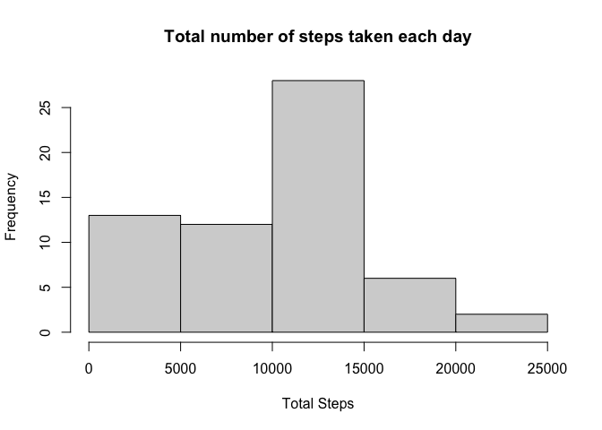
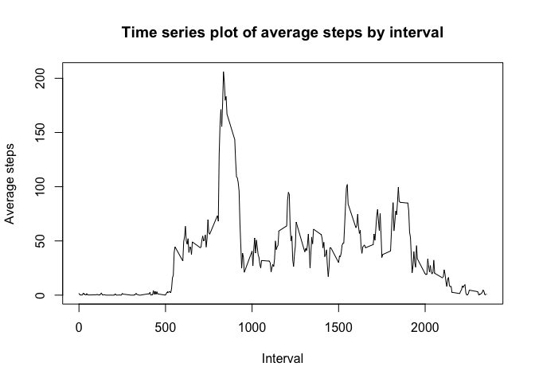
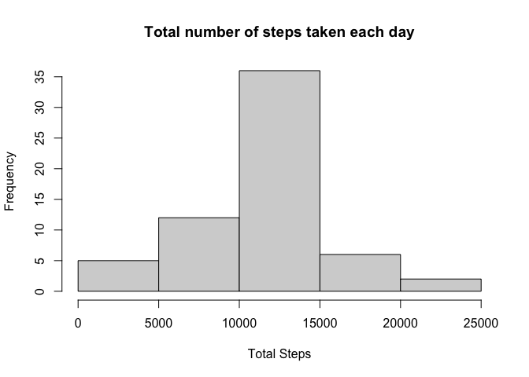
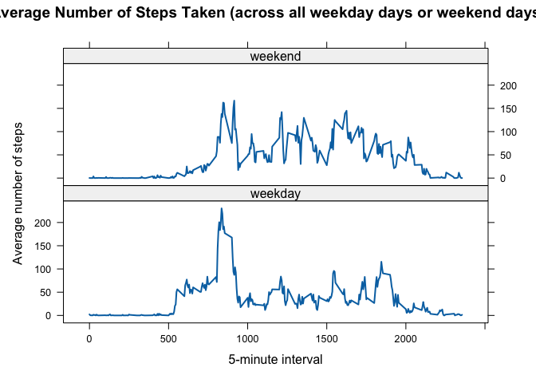

## Loading and preprocessing the data

```r
        library(readr)
        activity <- read_csv("activity.csv")
```

```
## Rows: 17568 Columns: 3
## ── Column specification ────────────────────────────────────────────────────────
## Delimiter: ","
## dbl  (2): steps, interval
## date (1): date
## 
## ℹ Use `spec()` to retrieve the full column specification for this data.
## ℹ Specify the column types or set `show_col_types = FALSE` to quiet this message.
```

```r
        head(activity)
```

```
## # A tibble: 6 × 3
##   steps date       interval
##   <dbl> <date>        <dbl>
## 1    NA 2012-10-01        0
## 2    NA 2012-10-01        5
## 3    NA 2012-10-01       10
## 4    NA 2012-10-01       15
## 5    NA 2012-10-01       20
## 6    NA 2012-10-01       25
```

## What is mean total number of steps taken per day?
### 1. Make a histogram of the total number of steps taken each day

```r
        library(dplyr)
```

```
## 
## Attaching package: 'dplyr'
```

```
## The following objects are masked from 'package:stats':
## 
##     filter, lag
```

```
## The following objects are masked from 'package:base':
## 
##     intersect, setdiff, setequal, union
```

```r
        df <- activity
        df_grp_date = df %>% group_by(date)  %>%
        summarise(total_steps = sum(steps, na.rm = TRUE),
                  total_interval = sum(interval),
                  .groups = 'drop')
        hist(df_grp_date$total_steps, 
             xlab = "Total Steps", ylab = "Frequency", 
             main = "Total number of steps taken each day")
```

<!-- -->

### 2. Calculate and report the mean and median total number of steps taken per day

```r
        mean(df_grp_date$total_steps)
```

```
## [1] 9354.23
```

```r
        median(df_grp_date$total_steps)
```

```
## [1] 10395
```

## What is the average daily activity pattern?
### 1. Make a time series plot (i.e. type = "l") of the 5-minute interval (x-axis) and the average number of steps taken, averaged across all days (y-axis)

```r
        library(dplyr)
        df <- activity
        df_interval = df %>% group_by(interval)  %>%
        summarise(avg_steps = mean(steps, na.rm = TRUE),
                  .groups = 'drop')
        plot(x = df_interval$interval, y = df_interval$avg_steps, type = "l", 
             xlab = "Interval", ylab = "Average steps", 
             main = "Time series plot of average steps by interval")
```

<!-- -->

### 2. Which 5-minute interval, on average across all the days in the dataset, contains the maximum number of steps?

```r
        df_interval$interval[which.max(df_interval$avg_steps)]
```

```
## [1] 835
```

## Imputing missing values
### 1. Calculate and report the total number of missing values in the dataset (i.e. the total number of rows with NAs)

```r
        sum(is.na(activity))
```

```
## [1] 2304
```

### 2. Devise a strategy for filling in all of the missing values in the dataset. The strategy does not need to be sophisticated. For example, you could use the mean/median for that day, or the mean for that 5-minute interval, etc.

**Strategy: Using the mean of 5-min interval**

### 3. Create a new dataset that is equal to the original dataset but with the missing data filled in.

```r
        dfNN <- activity 
                 for (i in df_interval$interval) {
                 dfNN[dfNN$interval == i & is.na(dfNN$steps), ]$steps <- 
                         df_interval$avg_steps[df_interval$interval == i]
                 }
        head(dfNN)
```

```
## # A tibble: 6 × 3
##    steps date       interval
##    <dbl> <date>        <dbl>
## 1 1.72   2012-10-01        0
## 2 0.340  2012-10-01        5
## 3 0.132  2012-10-01       10
## 4 0.151  2012-10-01       15
## 5 0.0755 2012-10-01       20
## 6 2.09   2012-10-01       25
```

### 4. Make a histogram of the total number of steps taken each day and Calculate and report the mean and median total number of steps taken per day. Do these values differ from the estimates from the first part of the assignment? What is the impact of imputing missing data on the estimates of the total daily number of steps?

```r
        library(dplyr)
        dfIN = dfNN %>% group_by(date)  %>%
        summarise(total_steps = sum(steps, na.rm = TRUE),
                  total_interval = sum(interval),
                  .groups = 'drop')
        hist(dfIN$total_steps,
             xlab = "Total Steps", ylab = "Frequency", 
             main = "Total number of steps taken each day")
```

<!-- -->

```r
        mean(dfIN$total_steps)
```

```
## [1] 10766.19
```

```r
        median(dfIN$total_steps)
```

```
## [1] 10766.19
```
**The mean is the same but the median changes. Imputing missing data and using the mean of steps on interval to replace it makes more value in the middle of the data, thus changing the median from the original value to the mean value that has been used as an estimate. The histogram became more bell-shaped.**

## Are there differences in activity patterns between weekdays and weekends?
### 1. Create a new factor variable in the dataset with two levels -- "weekday" and "weekend" indicating whether a given date is a weekday or weekend day.

```r
        dfNN$day <- weekdays(dfNN$date)
        dfNN$week <- ""
        dfNN[dfNN$day == "Saturday" | dfNN$day == "Sunday", ]$week <- "weekend"
        dfNN[!(dfNN$day == "Saturday" | dfNN$day == "Sunday"), ]$week <- "weekday"
        dfNN$week <- factor(dfNN$week)
```

### 2. Make a panel plot containing a time series plot (i.e. type = "l") of the 5-minute interval (x-axis) and the average number of steps taken, averaged across all weekday days or weekend days (y-axis). The plot should look something like the following, which was created using simulated data:

```r
        dfNN_avg_step <- aggregate(steps ~ interval + week, data = dfNN, mean)
        library(lattice)
        xyplot(steps ~ interval | week, data = dfNN_avg_step, type = "l", lwd = 2,
               layout = c(1, 2), 
               xlab = "5-minute interval", 
               ylab = "Average number of steps",
               main = "Average Number of Steps Taken (across all weekday days or weekend days)")
```

<!-- -->
